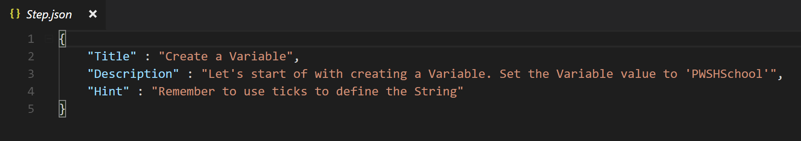

# Submit lessons to PWSHSchool

First of all, since you're here thanks for considering contributing to this project! 
Please be sure to also check out the [Contribution Guide](CONTRIBUTING.md), since I also recommend 
you stick to it while contributing lessons.

## How lessons are built up

Basically you have a topic you want to showcase. A module of yours for example.

Go ahead and think about how you could divide that topic up into different steps for somebody to learn it.

I also highly recommend you check out the [documentation on using the module](Students.md). Like this you will see what people are gonna face with your lessons. 

Also also, Check out my (very basic) [lesson on Powershell datatypes](https://github.com/bateskevin/PWSHSchool/tree/master/Lessons/Variable_Datatypes). This could serve you as a template for your first lesson.

## Speaking of steps

Speaking of steps, cause that's exactly how you gonna do it. There is a basic folder structure to follow 
while creating a PWSHSchool lesson. Let me show it to you.

# How to build your lesson

## Root Folder

Your Rootfolder will have the name of your lesson. **Make sure it does not contain spaces or weird characters**

### Lesson.json 

In your root folder you will need a "Lesson.json" file. 


You will have to set the following values:

1. **Name** --> This will be the name of your lesson (so choose it wisely ;))

2. **Level** --> This will indicate how difficult your lesson is gonna be. 
 you can choose one of the following values for the level of your lesson:
  * Beginner
  * Intermediate
  * Advanced
  * Expert
 
 3. **Prerequisites** --> If your lessons requires modules you should put its name here. PWSHSchool is then going to download it before the lesson starts. **This is for Modules on the Gallery**
 
 4. **Artifacts** --> If you want to load Modules that are not in the gallery you can add a Folder (the folder should have the same name as the module file it contains) to the Artifacts folder. The Artifacts Folder should be stored in the root folder. 
 
 ## Step Folder 
 
 step folders are located in the root folder. The naming convention should be alphabetically, 
 so that they get executed in the right order. I myself just name them "step1","Step2",etc.
 
 here is what they contain:
 
 ### Step.json
 
 The Step.json file should contain the following information:
 
 
 
1. **Title** --> This will be the Title of this step.

2 **Description** --> This will be the task-position you leave the people who do your lesson. Make it very clear what you want them to do.

3. **Hint** --> If you feel like it's needed, you can leave a hint to how this task could get solved. The Hints can get called by the people who do your lesson.

### Template.ps1
  
  Also in the step you add a template.ps1 file. **It is important you respect the naming convention**.
  
  This File should contain a function that returns a value in the end. 
  Like this the Pester tests will pick up that value and work with that. 
  
  Also it should be well commented, so the user knows where to change stuff and where not.
  
  For example such a function could look like this (Example of Variable_Types lesson):
  
 ```
 Function Define-Datatype {
    
    #create your variable under here
    

    #return your variable here (delete <variablename> and replace it with your variable)
    return <variable>
}

# Save your code when finished and continue in the shell you started the Lesson.
 ```
 It does not have to be functional, in fact in the start it **should** fail the tests. 
 
 ### Tests
 
 This is the heart and soul of your task as a contributor. The test folder lies in each step folder.
 
 Write your test(s) for each step and put them in the Tests folder. 
 
 These Tests should then test, if the user altered the code correctly.
 
 The user will see the error messages pester creates if they fail. So also here, try your best 
 to make your tests as meaningfull as possible. 
 
 As an example, here is the test, that tests the function mentioned above:
 
 ```
 $File = (Get-Childitem "$PSScriptRoot\..\" -File) | ?{$_.name -ne "Template.ps1" -and $_.name -ne "Step.json"}  | select fullname

. $File.Fullname

Import-Module Pester

Describe "Testing Step1" {
    it "The variable should contain 'PWSHSchool'" {
        $variable = Define-Datatype
        $variable | Should BeExactly "PWSHSchool" 
    }
}
 ```
The Part of this code untill Import-Module pester will load the correct function. (The file the user is working on is a file that will be in the step folder). Take this and just adapt the test in the describe block.

# How do I add it to the module?

Once you have a fully finished lesson. Clone this module and save it in the "PWHSSchool\Lessons" directory. Then import the Module and you can try out your lesson with the following code:

```
Start-PWSHSchoolLesson -Lesson <Your_Lesson_Name>
```
It will automatically be available for autocompletion, so no need for "Your_Lesson_Name".

## Test it

Try it out yourself and if it works how you imagine, go ahead and submit a pull request. 

## Once again

Thanks for your interest in this module! I would love to see what you do with this module.
