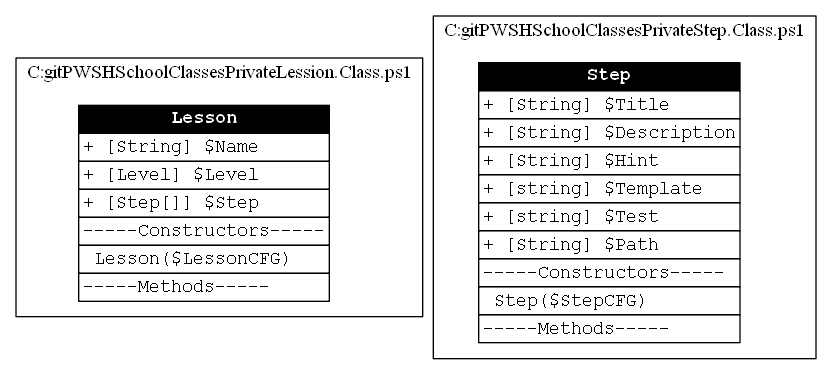

#Class documentation

I use two classes. I'll let [PSClassUtils](https://github.com/Stephanevg/PSClassUtils) speak for me here:

## Design

I use a combination of two JSON files to create the classes. One called lesson.json and the other step.json. 
Each of these files contains the information for what the name of the file suggests.

You can check out the diagram above to see what information gets configured in the json.

