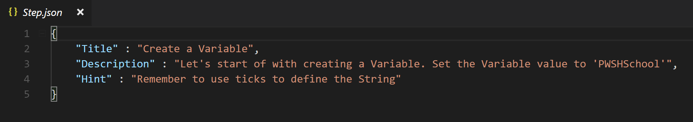

## Class documentation

I use two classes. I'll let [PSClassUtils](https://github.com/Stephanevg/PSClassUtils) speak for me here:


## Design

I use a combination of two JSON files to create the classes. One called Guide.json and the other step.json. 
Each of these files contains the information for what the name of the file suggests.

You can check out the diagram above to see what information gets configured in the json.

## How it's built up

## Root Folder

Your Rootfolder will have the name of your Guide. **Make sure it does not contain spaces or weird characters**

### Guide.json 

In your root folder you will need a "Guide.json" file. 


You will have to set the following values:

1. **Name** --> This will be the name of your Guide (so choose it wisely ;))

2. **Level** --> This will indicate how difficult your Guide is gonna be. 
 you can choose one of the following values for the level of your Guide:
  * Beginner
  * Intermediate
  * Advanced
  * Expert
 
 3. **Prerequisites** --> If your Guide requires modules you should put its name here. PSAtlas is then going to download it before the Guide starts. **This is for Modules on the Gallery**
 
 4. **Artifacts** --> If you want to load Modules that are not in the gallery you can add a Folder (the folder should have the same name as the module file it contains) to the Artifacts folder. The Artifacts Folder should be stored in the root folder. 
 
 ## Step Folder 
 
 step folders are located in the root folder. The naming convention should be alphabetically, 
 so that they get executed in the right order. I myself just name them "step1","Step2",etc.
 
 here is what they contain:
 
 ### Step.json
 
 The Step.json file should contain the following information:
 
 
 
1. **Title** --> This will be the Title of this step.

2 **Description** --> This will be the task-position you leave the people who do your Guide. Make it very clear what you want them to do.

3. **Hint** --> If you feel like it's needed, you can leave a hint to how this task could get solved. The Hints can get called by the people who do your Guide.

### Template.ps1
  
  Also in the step you add a template.ps1 file. **It is important you respect the naming convention**.
  
  This File should contain a function that returns a value in the end. 
  Like this the Pester tests will pick up that value and work with that. 
  
  Also it should be well commented, so the user knows where to change stuff and where not.
  
  For example such a function could look like this (Example of Variable_Types Guide):
  
 ```
 Function Define-Datatype {
    
    #create your variable under here
    

    #return your variable here (delete <variablename> and replace it with your variable)
    return <variable>
}

# Save your code when finished and continue in the shell you started the Guide.
 ```
 It does not have to be functional, in fact in the start it **should** fail the tests. 
 
 ### Tests
 
 This is the heart and soul of your task as a contributor. The test folder lies in each step folder.
 
 Write your test(s) for each step and put them in the Tests folder. 
 
 These Tests should then test, if the user altered the code correctly.
 
 The user will see the error messages pester creates if they fail. So also here, try your best 
 to make your tests as meaningfull as possible. 
 
 As an example, here is the test, that tests the function mentioned above:
 
 ```
 $File = (Get-Childitem "$PSScriptRoot\..\" -File) | ?{$_.name -ne "Template.ps1" -and $_.name -ne "Step.json"}  | select fullname

. $File.Fullname

Import-Module Pester

Describe "Testing Step1" {
    it "The variable should contain 'PSAtlas'" {
        $variable = Define-Datatype
        $variable | Should BeExactly "PSAtlas" 
    }
}
 ```
The Part of this code untill Import-Module pester will load the correct function. (The file the user is working on is a file that will be in the step folder). Take this and just adapt the test in the describe block.
