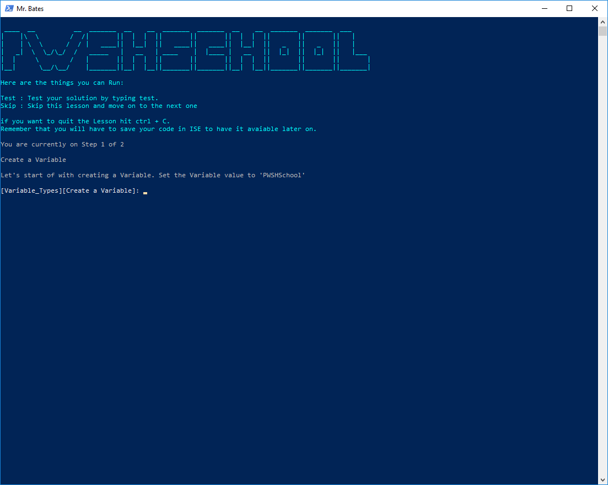
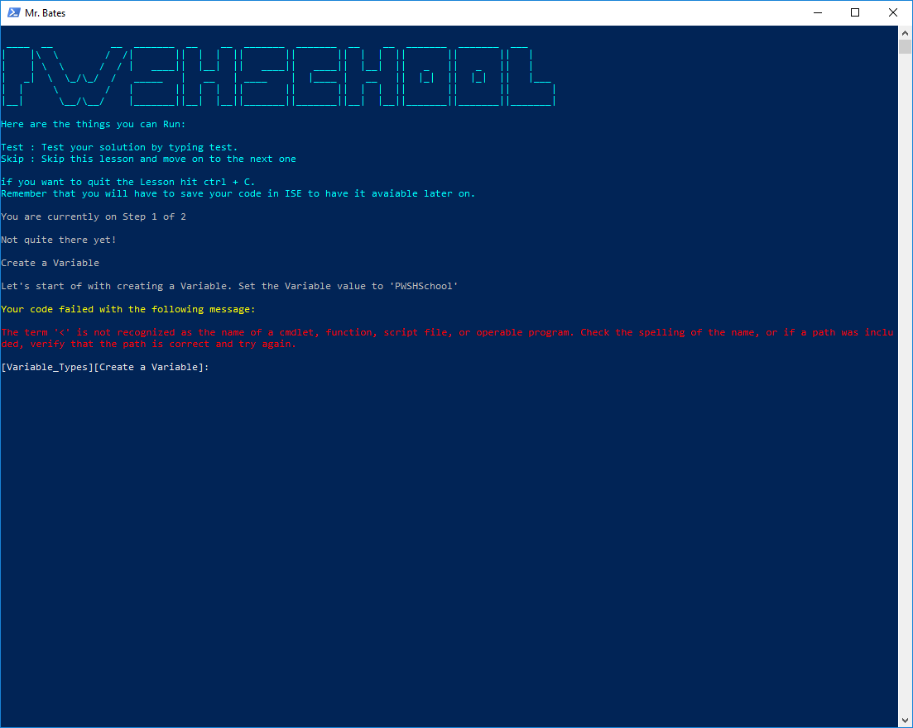

# Take Guides

Hey, in this document you will learn how to use PSAtlas as a Student. 

First of all let's look at what steps are needed for you to be able to use PSAtlas.

## Prerequisites

### Install the Module

```
Find-Module -Name PSAtlas | Install-Module
Find-Module -Name Pester | Install-Module
Import-Module PSAtlas
```

Note that you do need the Pester Module (Powershell testing framework) in order to use this Module
There is however no need for you to import it every time. PSAtlas does that for you.

## Find the Guides suited best for you

Once you completed the prerequisites you'll have installed the module and importet it.

It is now ready to use! So let's take advantage of that.

### Find Guides

to search for Guides you can use the following code.

```
Get-PSAtlasGuide
```

This will list you all the Guides that are available in your version. It will look something like this:
```
Name              Level Step
----              ----- ----
Variable_Types Beginner {Step, Step}
```

If you know a Guide by name you can add the name parameter to your function:

```
Get-PSAtlasGuide -on "Variable_Types"
```

In this case it will return the same output (since there is one Guide available so far:) this will get updated as soon as more Guides are available) The output will look like this:
```
Name              Level Step
----              ----- ----
Variable_Types Beginner {Step, Step}
```

## Start a Guide

Important: The powershell console you start your Guide from should have administrative privileges.

Once you found a Guide you can start a Guide with the following code:
```
Start-PSAtlasGuide -on Variable_Datatypes
```
### Autocompletion
All Guides available support autocompletion. You can therefore also use that to browse for keywords.

## How Guides work

### Console --> Interface
Ok you started your Guide. Now the console you started in will become your Interface. This will look like this:



Note that in the console you will at all time see on which step you are, what your current task is and you also
get displayed what you can enter in the console. 

### Editor --> VSCode
Next to the console getting your interface, VSCode will start up and load your first task.

optionally you can start PSAtlas with Powershell ISE if you like. Just add the "StartWithISE" parameter to your call.

```
Start-PSAtlasGuide -on Variable_Datatypes -StartWithISE
```

As an example. The first task from the Variable_Types Guide will look like this in VSCode:


## Edit and test your code

So the Workflow is the Following:

* Read the Task in the Console
* Edit your code according to the Task in the console
* Save your code in the editor 
* now you can run a test

## Test your code

To run a test, simply type "test" in the console and hit enter.

If your test fails you will get shown the error message in the console:



If your code passes the tests you will automatically move on to the next task.

## Skip a task

You can also skip a task if you are not interessted or can't handle it at that time (or god forbid even a bug appears).
Your progress will be saved (by you in the ISE) and the next time you get to that task you will be asked if you want to continue.

To skip the task, simply type "skip" in the console and hit enter.

## Exit 

If you want to exit, simply hit ctrl+c and you'll be in your shell just as before you started.

As long as you save your code in the ISE, you will be able to pick up right where you left.

## Clear the Guide

You feel like you need a new start to a specific Guide? Exit the Guide and use the following 
code to clear it up and you'll be able to have a new start:

```
Clear-AtlasGuide -on Variable_Datatypes
```

## That's it

That's it folks! You can now use PSAtlas! Have fun learning!
